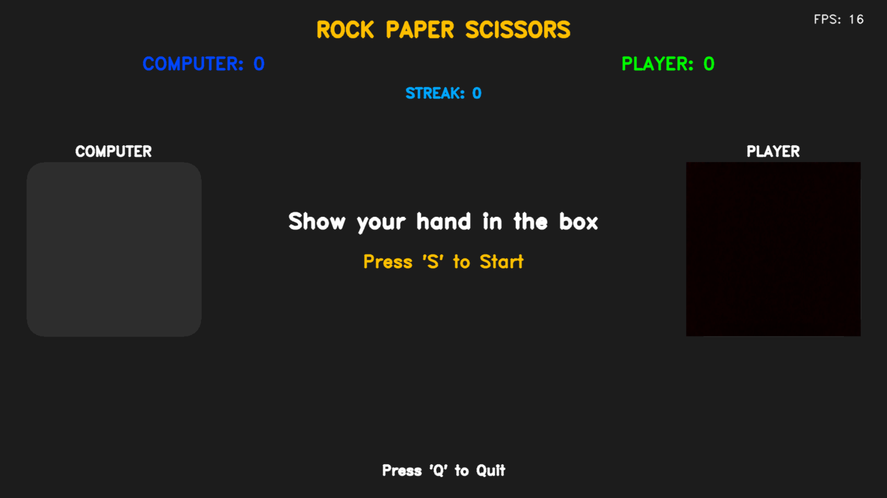

# 🎮 Rock Paper Scissors - Vision Edition

[](https://www.python.org/)
[](https://opencv.org/)
[](https://mediapipe.dev/)
[](https://github.com/Rakshak-D/RPS-Vision/issues)
[](LICENSE)

An advanced, computer vision-based Rock Paper Scissors game that uses your webcam and hand gestures for intuitive gameplay. Features a modern full-screen UI, real-time gesture recognition, and dynamic visual feedback.



---

## ✨ Key Features

### 👋 Hand Gesture Recognition
- Real-time hand tracking using MediaPipe Hands
- Robust Rock/Paper/Scissors gesture detection
- Gesture smoothing algorithm to prevent flickering
- Works with both left and right hands

### 🎨 Modern UI/UX
- Dynamic full-screen interface that adapts to any resolution
- Elegant rounded panels and smooth animations
- Professional color scheme with accent highlights
- Real-time FPS counter and performance stats

### 🔊 Immersive Audio
- Custom synthesized sound effects for all game events
- Soft decay tones for pleasant audio feedback
- Stereo sound output with volume optimization
- Event-specific audio cues (countdown, win, lose, draw)

### 🎯 Smart Game Logic
- Gesture history averaging for stable input
- Automatic round management with countdown timer
- Win streak tracking and score persistence
- Invalid move detection and feedback

### ⚡ Performance Optimized
- Efficient webcam frame processing
- Dynamic resolution scaling
- Frame rate target locking (30 FPS)
- Memory-efficient gesture history

---

## 🚀 Quick Start

### Prerequisites
- Python 3.9+
- Webcam
- Windows/macOS/Linux

```bash
# Clone repository
git clone https://github.com/your-username/RPS-Vision.git
cd RPS-Vision

# Create virtual environment (recommended)
python -m venv .venv
source .venv/bin/activate  # Linux/Mac
# OR
.venv\Scripts\activate     # Windows

# Install dependencies
pip install -r requirements.txt

# Launch the game
python RPS.py
```

**Game Controls:**
- `S` - Start new round (from splash screen)
- `R` - Reset game (anytime)
- `Q` or `ESC` - Quit game

---

## 🎮 How to Play

### Gesture Guide
- **Rock** 👊: Closed fist (0 fingers extended)
- **Paper** ✋: Open palm (5 fingers extended)  
- **Scissors** ✌️: Index and middle fingers extended (2 fingers)

### Game Flow
1. **Splash Screen**: Position your hand in the player panel
2. **Countdown**: Show your gesture during 3-second countdown
3. **Results**: See computer's choice and round outcome
4. **Repeat**: Automatic next round after result display

### Pro Tips
- Keep your hand within the player ROI (green box)
- Maintain consistent gesture during countdown
- Ensure good lighting for better detection
- Position webcam at eye level for optimal angle

---

## 🛠 Technology Stack

| Component | Technologies |
|-----------|--------------|
| **Computer Vision** | OpenCV, MediaPipe Hands |
| **UI Framework** | OpenCV Drawing Primitives |
| **Audio** | Pygame Mixer, NumPy Signal Processing |
| **Math & Processing** | NumPy, Collections |
| **System Integration** | tkinter, time, random |

### Core Algorithms
- **Hand Landmark Detection**: MediaPipe 21-point hand model
- **Gesture Classification**: Finger extension analysis
- **Smoothing Filter**: Majority voting over 8-frame history
- **Dynamic Scaling**: Resolution-adaptive UI elements

---

## 📁 Project Structure

```
RPS-Vision/
├── RPS.py                 # Main game application
├── requirements.txt       # Python dependencies
├── README.md             # Project documentation
└── assets/               # (Optional) Additional resources
    ├── sounds/           # Custom audio files
    └── icons/            # Game element graphics
```

### Code Architecture
```python
# Main Components:
- RPSGame Class: Core game logic and state management
- Gesture Recognition: Finger status analysis and mapping
- UI Rendering: Text, shapes, and dynamic elements
- Audio System: Procedural sound generation
- Main Loop: Frame processing and event handling
```

---

## 📋 Core Dependencies

```text
# Computer Vision & Processing
opencv-python==4.11.0.86
mediapipe==0.10.21
numpy==1.26.4

# Audio & Multimedia  
pygame==2.6.1

# Utilities
Pillow==9.5.0
matplotlib==3.7.2
kiwisolver==1.4.4
```

---

## 🐛 Troubleshooting

### Common Issues & Solutions

**Webcam Not Detected:**
```bash
# Try different backend
cap = cv2.VideoCapture(0, cv2.CAP_DSHOW)  # Windows DirectShow
cap = cv2.VideoCapture(0, cv2.CAP_V4L2)   # Linux V4L2
```

**Low Gesture Detection Accuracy:**
- Ensure good lighting on your hand
- Keep background simple and uncluttered
- Position hand fully within the green ROI box
- Avoid rapid hand movements

**Performance Issues:**
- Close other camera applications
- Reduce background processes
- Ensure latest webcam drivers

### Issue Reporting

[](https://github.com/your-username/RPS-Vision/issues)

**Bug Report Template:**
```markdown
## Description
[Clear explanation of the issue]

## Reproduction Steps
1. Launch game
2. Perform specific action...
3. Observe error...

**Expected Behavior**  
[What should happen]

**Actual Behavior**  
[What actually happens]

**Environment**  
- OS: [e.g., Windows 11, Ubuntu 22.04]
- Python Version: [e.g., 3.9.18]
- Webcam Model: [e.g., Logitech C920]

**Screenshots/Logs**  
[If applicable]
```

---

## 📜 License

This project is licensed under the MIT License - see [LICENSE](LICENSE) file for complete terms.

---

## 🤝 Contributing

### Development Setup
1. Fork the repository
2. Create feature branch (`git checkout -b feature/amazing-feature`)
3. Commit changes (`git commit -am 'Add amazing feature'`)
4. Push to branch (`git push origin feature/amazing-feature`)
5. Open Pull Request

### Code Standards
- Follow PEP 8 style guide
- Use descriptive variable names
- Add comments for complex logic
- Test on multiple resolutions

---

## 🎯 Future Enhancements

### Planned Features
- 🎨 Custom theme selector
- 📊 Advanced statistics and history
- 🌐 Multiplayer support
- 📱 Mobile app version
- 🤖 AI opponent with difficulty levels

### Development Roadmap
- [ ] Add gesture calibration
- [ ] Implement session recording
- [ ] Create installation package
- [ ] Add unit tests

---

## 📬 Contact & Support

**Project Maintainer**  
Your Name  
📧 rakshakmce@gmail.com  
🔗 [GitHub Profile](https://github.com/Rakshak-D)

**Need Help?**  
- Check [Troubleshooting](#🐛-troubleshooting) section
- Open a [GitHub Issue](https://github.com/Rakshak-D/RPS-Vision/issues)
- Review code comments in `RPS.py`

---

<div align="center">

**Ready to play? Run `python RPS.py` and show your moves!** 🎮✋

</div>
